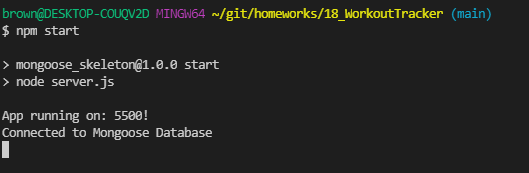
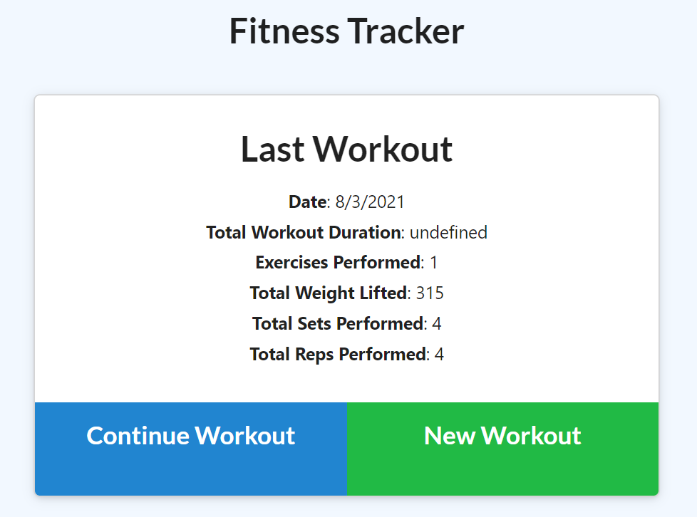
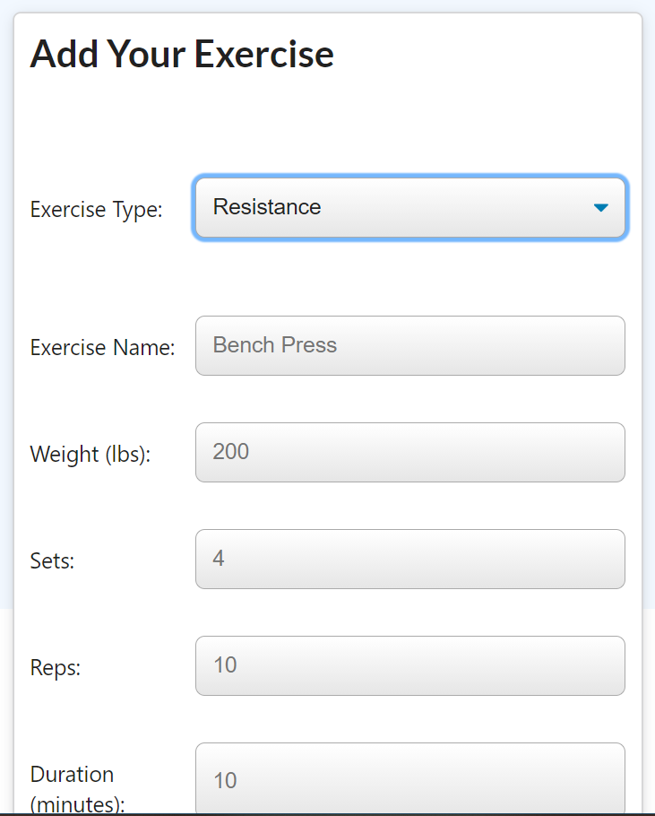
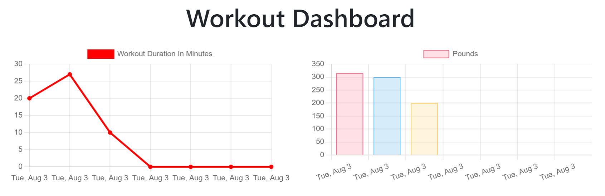
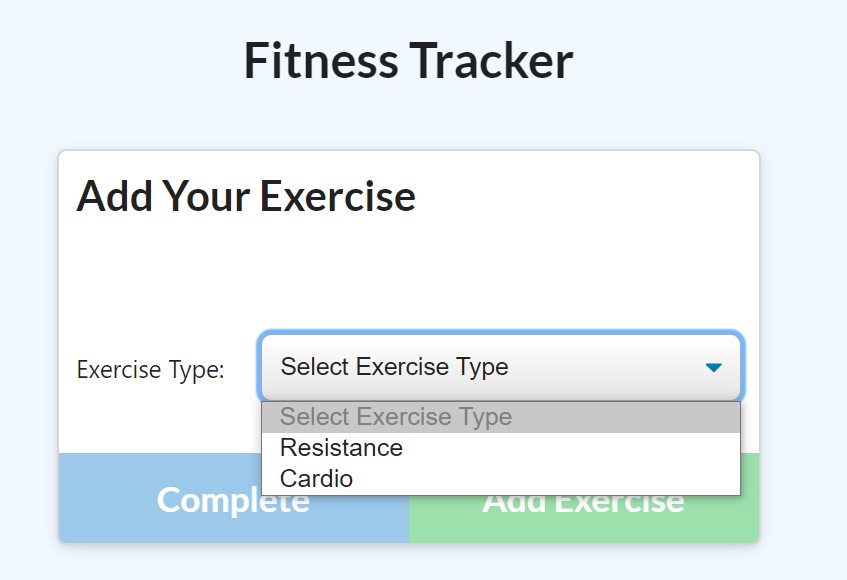

# 18_WorkoutTracker

For this assignment, you'll create a workout tracker. You have already been provided with the front end code in the `Develop` folder. This assignment will require you to create Mongo database with a Mongoose schema and handle routes with Express.

## User Story

- As a user, I want to be able to view create and track daily workouts. I want to be able to log multiple exercises in a workout on a given day. I should also be able to track the name, type, weight, sets, reps, and duration of exercise. If the exercise is a cardio exercise, I should be able to track my distance traveled.

## Business Context

A consumer will reach their fitness goals more quickly when they track their workout progress.

## Acceptance Criteria

When the user loads the page, they should be given the option to create a new workout or continue with their last workout.

The user should be able to:

- Add exercises to the most recent workout plan.

- Add new exercises to a new workout plan.

- View the combined weight of multiple exercises from the past seven workouts on the `stats` page.

- View the total duration of each workout from the past seven workouts on the `stats` page.

## Table of Contents

- [Links to Application](#Links)
- [Mock-Up](#Mock-Up)
- [Install](#installation)
- [Usage](#usage)
- [Credits](#credits)
- [Test](#test)
- [Questions](#questions)

## Links

Below are links to access the deployed video link and repository.

Github Repository: https://github.com/bergannation/18_WorkoutTracker

Deployed Heroku Link: https://bergan-workout-tracker.herokuapp.com/?id=61099adbc0d7640015d15a9f

## Description

This project consists of the following:

HTML
CSS
Javascript
Node.js
Express
MongoDB
Heroku

## Installation

- Clone the Repository using Terminal: git clone git@github.com:bergannation/18_WorkoutTracker.git
- Change directory, "cd" into the Appropriate Folder
- First install your packages with: npm i
- To run the Application you will need to run: npm start
  

## Mock-Up

- Basic Layout
  
- Adding an Exercise
  
- Exercise Breakdown
  
- This picture shows the available options when you want to add an exercise
  

## License

## Questions

Here is a link to my github for more information: [Github]: https://github.com/BerganNation

You can reach me with any additional questions by email: BerganNation@gmail.com
